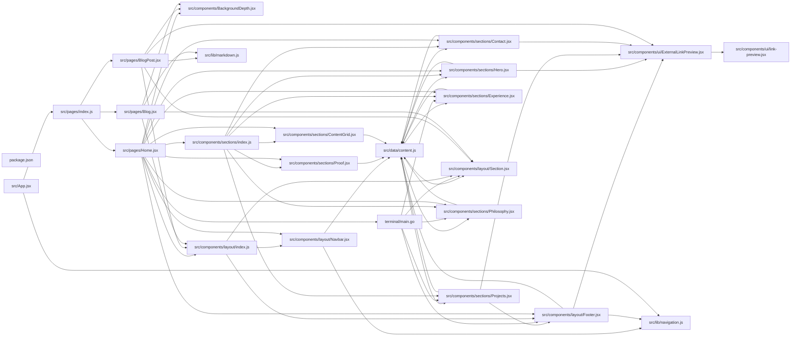

## ARCHITECTURE

A software project composed of the following subsystems:

- **src/**: Primary subsystem containing 40 files
- **cloudflare-worker/**: Primary subsystem containing 3 files
- **terminal/**: Primary subsystem containing 2 files
- **public/**: Primary subsystem containing 2 files
- **Root**: Contains scripts and execution points

## ENTRY_POINTS

### `terminal/main.go`

```go
package main

import (
	"fmt"
	"strings"

	"github.com/charmbracelet/lipgloss"
)

// Constants
const (
	maxWidth = 90
	// Colors
	primaryColor   = lipgloss.Color("6")  // Muted Cyan/Teal
	secondaryColor = lipgloss.Color("3")  // Soft Yellow/Gold
	textColor      = lipgloss.Color("15") // Near White
	subtleColor    = lipgloss.Color("8")  // Soft Gray
	accentColor    = lipgloss.Color("5")  // Muted Magenta/Purple
)

// --- STYLES ---

var (
	// Base container style
	containerStyle = lipgloss.NewStyle().
		MaxWidth(maxWidth).
		Padding(0, 2)

	// Header styles
	headerStyle = lipgloss.NewStyle().
		MarginBottom(1)
	nameStyle = lipgloss.NewStyle().
		Foreground(primaryColor).
		Bold(true).
		Render
	subtitleStyle = lipgloss.NewStyle().
		Foreground(subtleColor).
		Render

	// Footer styles
	footerStyle = lipgloss.NewStyle().
		Foreground(subtleColor).
		MarginTop(1).
		PaddingTop(1).
		BorderTop(true).
		BorderForeground(subtleColor)
	linkStyle = lipgloss.NewStyle().
		Foreground(primaryColor).
		Underline(true).
		Render

	// Content panel styles
	panelStyle = lipgloss.NewStyle().
		Border(lipgloss.RoundedBorder()).
		BorderForeground(subtleColor).
		Padding(1, 2).
		BorderBottom(true).
		BorderRight(true)

	panelTitleStyle = lipgloss.NewStyle().
		Foreground(secondaryColor).
		Bold(true).
		MarginBottom(1).
		Render

	// Text styles
	textStyle = lipgloss.NewStyle().
		Foreground(textColor)
	listItemStyle = lipgloss.NewStyle().
		MarginBottom(1)
	itemHeaderStyle = lipgloss.NewStyle().
		Foreground(textColor).
		Bold(true).
		Render
	itemMetaStyle = lipgloss.NewStyle().
		Foreground(subtleColor).
		Render
	tagStyle = lipgloss.NewStyle().
		Foreground(accentColor).
		Render
)

// --- CONTENT ---

// Section represents a panel in the UI
type Section struct {
	Title   string
	Content string
}

// --- UI BUILDERS ---

func buildHeader() string {
	name := nameStyle("Granth Agarwal")
	subtitle := subtitleStyle("Backend & Systems Engineer · Building for Scale")
	return headerStyle.Render(fmt.Sprintf("%s\n%s", name, subtitle))
}

func buildFooter() string {
	gh := linkStyle("GitHub")
	web := linkStyle("Website")
	return footerStyle.Render(fmt.Sprintf("Find me on %s or visit my %s.", gh, web))
}

func buildPanel(title, content string, width int) string {
	return panelStyle.Copy().Width(width).Render(fmt.Sprintf("%s\n%s", panelTitleStyle(title), content))
}

func buildListItem(header, meta, body string, tags []string) string {
	headerPart := itemHeaderStyle(header)
	metaPart := itemMetaStyle(meta)
	bodyPart := textStyle.Copy().Margin(0, 0, 1, 2).Render(body)
	tagsPart := ""
	if len(tags) > 0 {
		tagsPart = textStyle.Copy().Margin(0, 0, 0, 2).Render(tagStyle(strings.Join(tags, " · ")))
	}

	return listItemStyle.Render(
		fmt.Sprintf("%s %s\n%s%s", headerPart, metaPart, bodyPart, tagsPart),
	)
}

func main() {
	// --- DEFINE CONTENT SECTIONS ---
	leftPanelWidth := 38
	rightPanelWidth := 48

	// Left Column
	stackContent := strings.Join([]string{
		buildListItem("Languages", "", "Go, Python, SQL, TypeScript", []string{}),
		buildListItem("Core Stack", "", "FastAPI, Django, PostgreSQL, Redis, Celery, Docker", []string{}),
		buildListItem("Databases", "", "PostgreSQL (PostGIS, pgvector), Redis, ClickHouse", []string{}),
	}, "\n")

	philosophyContent := strings.Join([]string{
		buildListItem("Pragmatism", "", "Choosing the right tool for the job, not just the newest.", []string{}),
		buildListItem("Durability", "", "Building systems that are easy to understand, test, and maintain.", []string{}),
		buildListItem("Automation", "", "If it can be automated, it should be. From tests to infra.", []string{}),
	}, "\n")

	leftColumn := []Section{
		{Title: "Stack & Tools", Content: stackContent},
		{Title: "Philosophy", Content: philosophyContent},
	}

	// Right Column
	projectsContent := strings.Join([]string{
		buildListItem("TrustSystem", "Patent-backed Identity Verification", "Fraud detection using pgvector and Sentence Transformers.", []string{"Django", "PostgreSQL", "Redis"}),
		buildListItem("StandardStitch", "Multi-tenant Commerce Platform", "Enterprise backend with PostGIS for spatial queries.", []string{"40+ APIs", "Django", "PostGIS"}),
		buildListItem("MemeTrends", "Real-time Analytics Engine", "Redis-based leaderboards with time-decay algorithms.", []string{"O(log N)", "Django", "Redis"}),
	}, "\n\n")

	experienceContent := strings.Join([]string{
		buildListItem("Backend Developer", "Freelance (Oct 2025 – Present)", "Full ownership from architecture to deployment.", []string{"REST APIs", "Automated Testing", "PostGIS", "Celery"}),
		buildListItem("Python Developer", "EverythingAboutAI (Jul – Aug 2025)", "Developed FastAPI microservices and automation pipelines.", []string{"FastAPI", "Make.com"}),
	}, "\n\n")

	rightColumn := []Section{
		{Title: "Featured Projects", Content: projectsContent},
		{Title: "Experience", Content: experienceContent},
	}

	// --- RENDER ---
	var leftBlock, rightBlock []string
	for _, s := range leftColumn {
		leftBlock = append(leftBlock, buildPanel(s.Title, s.Content, leftPanelWidth))
	}
	for _, s := range rightColumn {
		rightBlock = append(rightBlock, buildPanel(s.Title, s.Content, rightPanelWidth))
	}

	mainContent := lipgloss.JoinHorizontal(
		lipgloss.Top,
		lipgloss.JoinVertical(lipgloss.Top, leftBlock...),
		lipgloss.JoinVertical(lipgloss.Top, rightBlock...),
	)

	// Final assembly
	ui := containerStyle.Render(
		lipgloss.JoinVertical(
			lipgloss.Left,
			buildHeader(),
			mainContent,
			buildFooter(),
		),
	)

	fmt.Println(ui)
}
```

## SYMBOL_INDEX

**`src/components/layout/Navbar.jsx`**
- `Navbar()`

**`src/components/layout/Footer.jsx`**
- `Footer()`

**`src/components/sections/Hero.jsx`**
- `Hero()`

**`src/components/sections/Projects.jsx`**
- `ProjectCard()`
- `Projects()`

**`src/components/sections/Contact.jsx`**
- `Contact()`

**`terminal/main.go`**
- class `Section`
- `buildHeader()`
- `buildFooter()`
- `buildPanel()`
- `buildListItem()`
- `main()`

**`src/components/sections/Experience.jsx`**
- `EraCard()`
- `Experience()`

**`src/components/layout/Section.jsx`**
- `Section()`

**`src/components/sections/Proof.jsx`**
- `Proof()`

**`src/components/sections/Philosophy.jsx`**
- `Philosophy()`

**`src/components/ui/ExternalLinkPreview.jsx`**
- `getInitialMobileState()`
- `ExternalLinkPreview()`

**`src/pages/Home.jsx`**
- `Home()`

**`src/lib/navigation.js`**
- `pathMatches()`

**`src/pages/BlogPost.jsx`**
- `BlogPost()`

**`src/lib/markdown.js`**
- `formatDate()`

**`src/components/sections/ContentGrid.jsx`**
- `ContentGrid()`

**`src/App.jsx`**
- `ScrollManager()`
- `App()`

**`src/pages/Blog.jsx`**
- `Blog()`

**`src/components/ui/link-preview.jsx`**
- `getMicrolinkEndpoint()`
- `LinkPreview()`

## IMPORTANT_CALL_PATHS

index()
  → Footer.Footer()
  → navigation.pathMatches()
## CORE_MODULES

### `src/data/content.js`

**Purpose:** Implements content.

### `src/components/layout/Navbar.jsx`

**Purpose:** Implements Navbar.

**Functions:**
- `const Navbar = ...`

**Notes:** large file (306 lines)

### `src/components/layout/Footer.jsx`

**Purpose:** Implements Footer.

**Functions:**
- `const Footer = ...`

### `src/components/sections/Hero.jsx`

**Purpose:** Implements Hero.

**Functions:**
- `const Hero = ...`

### `src/components/sections/Projects.jsx`

**Purpose:** Implements Projects.

**Functions:**
- `const ProjectCard = ...`
- `const Projects = ...`

### `src/components/sections/Contact.jsx`

**Purpose:** Implements Contact.

**Functions:**
- `const Contact = ...`

### `src/components/sections/Experience.jsx`

**Purpose:** Implements Experience.

**Functions:**
- `const EraCard = ...`
- `const Experience = ...`

## SUPPORTING_MODULES

### `src/components/layout/Section.jsx`

```javascript
const Section = ...

```

### `src/components/sections/Proof.jsx`

```javascript
const Proof = ...

```

### `src/components/BackgroundDepth.jsx`

*35 lines, 1 imports*

### `src/components/layout/index.js`

*4 lines, 0 imports*

### `src/components/sections/Philosophy.jsx`

```javascript
const Philosophy = ...

```

### `src/components/sections/index.js`

*8 lines, 0 imports*

### `src/components/ui/ExternalLinkPreview.jsx`

```javascript
const getInitialMobileState = ...

const ExternalLinkPreview = ...

```

### `src/pages/Home.jsx`

```javascript
const Home = ...

```

### `src/lib/navigation.js`

```javascript
const pathMatches = ...

```

### `src/pages/index.js`

*5 lines, 0 imports*

### `src/pages/BlogPost.jsx`

```javascript
const BlogPost = ...

```

### `src/lib/markdown.js`

```javascript
const formatDate = ...

```

### `src/components/sections/ContentGrid.jsx`

```javascript
const ContentGrid = ...

```

### `src/App.jsx`

```javascript
const ScrollManager = ...

function App()

```

### `src/pages/Blog.jsx`

```javascript
const Blog = ...

```

### `src/components/ui/link-preview.jsx`

```javascript
const getMicrolinkEndpoint = ...

const LinkPreview = ...

```

## DEPENDENCY_GRAPH



### Cyclic Dependencies

> [!WARNING]
> The following circular import chains were detected:

1. `src/components/ui/Card.jsx` -> `src/lib/animations.js`

## RANKED_FILES

| File | Score | Tier | Tokens |
|------|-------|------|--------|
| `src/data/content.js` | 0.762 | structured summary | 13 |
| `src/components/layout/Navbar.jsx` | 0.585 | structured summary | 35 |
| `src/components/layout/Footer.jsx` | 0.564 | structured summary | 25 |
| `src/components/sections/Hero.jsx` | 0.511 | structured summary | 27 |
| `src/components/sections/Projects.jsx` | 0.491 | structured summary | 35 |
| `src/components/sections/Contact.jsx` | 0.484 | structured summary | 27 |
| `terminal/main.go` | 0.440 | full source | 1506 |
| `src/components/sections/Experience.jsx` | 0.418 | structured summary | 35 |
| `src/components/layout/Section.jsx` | 0.390 | signatures | 18 |
| `src/components/sections/Proof.jsx` | 0.321 | signatures | 19 |
| `src/components/BackgroundDepth.jsx` | 0.321 | signatures | 17 |
| `src/components/layout/index.js` | 0.314 | signatures | 16 |
| `src/components/sections/Philosophy.jsx` | 0.301 | signatures | 21 |
| `src/components/sections/index.js` | 0.298 | signatures | 17 |
| `src/components/ui/ExternalLinkPreview.jsx` | 0.293 | signatures | 29 |
| `package.json` | 0.292 | one-liner | 10 |
| `src/pages/Home.jsx` | 0.286 | signatures | 16 |
| `src/lib/navigation.js` | 0.267 | signatures | 17 |
| `src/pages/index.js` | 0.255 | signatures | 15 |
| `src/pages/BlogPost.jsx` | 0.241 | signatures | 19 |
| `src/lib/markdown.js` | 0.232 | signatures | 17 |
| `src/components/sections/ContentGrid.jsx` | 0.212 | signatures | 21 |
| `src/App.jsx` | 0.205 | signatures | 19 |
| `src/pages/Blog.jsx` | 0.204 | signatures | 17 |
| `src/components/ui/link-preview.jsx` | 0.195 | signatures | 27 |
| `src/lib/animations.js` | 0.184 | one-liner | 12 |
| `index.html` | 0.160 | one-liner | 10 |
| `vite.config.js` | 0.146 | one-liner | 20 |
| `src/main.jsx` | 0.143 | one-liner | 15 |
| `src/components/ui/index.js` | 0.136 | one-liner | 13 |
| `src/pages/ProjectsPage.jsx` | 0.132 | one-liner | 22 |
| `src/components/ui/AnimatedText.jsx` | 0.131 | one-liner | 23 |
| `src/components/ui/Badge.jsx` | 0.131 | one-liner | 22 |
| `src/components/ui/GlowEffect.jsx` | 0.131 | one-liner | 23 |
| `.gitignore` | 0.110 | one-liner | 10 |
| `vercel.json` | 0.109 | one-liner | 11 |
| `src/components/ui/link-preview.tsx` | 0.107 | one-liner | 19 |
| `README.md` | 0.106 | one-liner | 10 |
| `src/posts/codectx.md` | 0.087 | one-liner | 15 |
| `cloudflare-worker/README.md` | 0.087 | one-liner | 14 |

## PERIPHERY

- `package.json` — 47 lines
- `src/lib/animations.js` — 348 lines
- `index.html` — 49 lines
- `vite.config.js` — 1 function, 4 imports, 85 lines
- `src/main.jsx` — 6 imports, 23 lines
- `src/components/ui/index.js` — 6 lines
- `src/pages/ProjectsPage.jsx` — 1 function, 3 imports, 18 lines
- `src/components/ui/AnimatedText.jsx` — 1 function, 2 imports, 63 lines
- `src/components/ui/Badge.jsx` — 1 function, 1 imports, 28 lines
- `src/components/ui/GlowEffect.jsx` — 1 function, 1 imports, 44 lines
- `.gitignore` — 30 lines
- `vercel.json` — 16 lines
- `src/components/ui/link-preview.tsx` — 5 imports, 152 lines
- `README.md` — 96 lines
- `src/posts/codectx.md` — 477 lines
- `cloudflare-worker/README.md` — 121 lines
- `cloudflare-worker/wrangler.toml` — 12 lines
- `src/components/ui/Card.jsx` — 1 function, 2 imports, 29 lines
- `public/favicon.svg` — 4 lines
- `terminal/go.mod` — 21 lines
- `src/posts/hello-world.md` — 95 lines
- `src/components/link-preview-demo.tsx` — 3 imports, 32 lines
- `components.json` — 28 lines
- `tsconfig.json` — 10 lines
- `cloudflare-worker/worker.js` — 2 functions, 77 lines
- `src/posts/why-i-chose-monolith.md` — 212 lines
- `src/components/data/content.js` — 2 lines
- `src/polyfills.js` — 1 imports, 21 lines
- `eslint.config.js` — 5 imports, 30 lines
- `postcss.config.js` — 6 lines
- `public/vite.svg` — 1 lines
- `src/App.css` — 43 lines
- `src/components/ui/Button.jsx` — 2 imports, 49 lines

