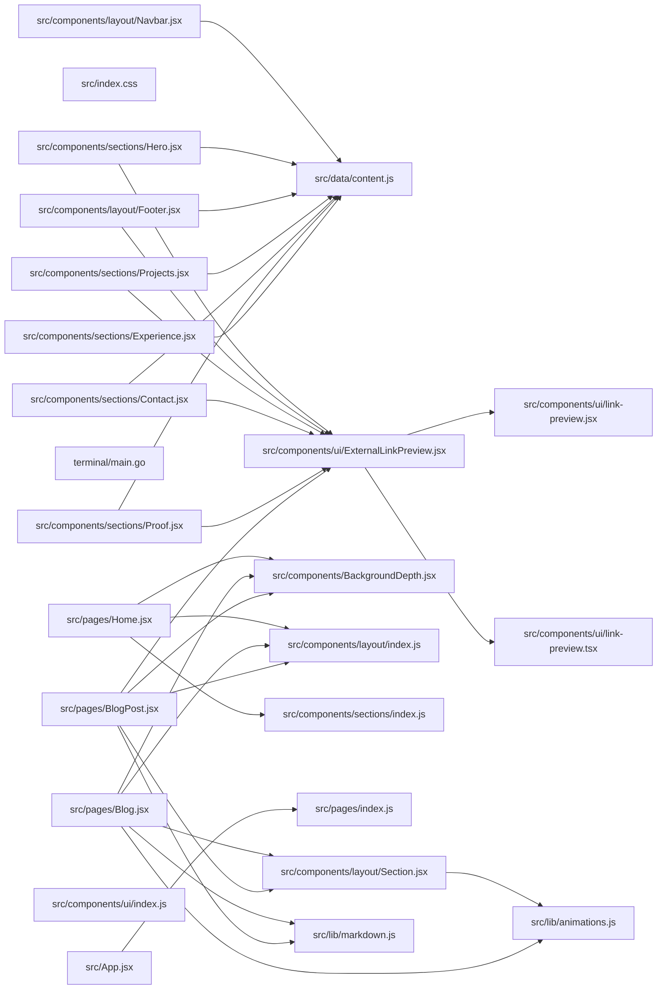

## ARCHITECTURE

A software project composed of the following subsystems:

- **src/**: Primary subsystem containing 39 files
- **cloudflare-worker/**: Primary subsystem containing 3 files
- **terminal/**: Primary subsystem containing 2 files
- **public/**: Primary subsystem containing 2 files
- **Root**: Contains scripts and execution points

## ENTRY_POINTS

*No entry points identified within budget.*

## SYMBOL_INDEX

**`src/components/layout/Navbar.jsx`**
- `Navbar()`

**`src/components/ui/ExternalLinkPreview.jsx`**
- `getInitialMobileState()`
- `ExternalLinkPreview()`

**`src/components/sections/Hero.jsx`**
- `Hero()`

**`src/components/layout/Footer.jsx`**
- `Footer()`

**`src/components/sections/Projects.jsx`**
- `ProjectCard()`
- `Projects()`

**`src/components/sections/Contact.jsx`**
- `Contact()`

**`src/components/layout/Section.jsx`**
- `Section()`

**`src/lib/markdown.js`**
- `formatDate()`

**`src/components/sections/Proof.jsx`**
- `devicon()`
- `onIconError()`
- `Proof()`

**`terminal/main.go`**
- class `Section`
- `buildHeader()`
- `buildFooter()`
- `buildPanel()`
- `buildListItem()`
- `main()`

**`src/components/sections/Experience.jsx`**
- `EraCard()`
- `Experience()`

**`src/pages/Home.jsx`**
- `Home()`

**`src/pages/Blog.jsx`**
- `Blog()`

**`src/pages/BlogPost.jsx`**
- `BlogPost()`

**`src/components/ui/link-preview.jsx`**
- `getMicrolinkEndpoint()`
- `LinkPreview()`

## IMPORTANT_CALL_PATHS

index()

index()

index()

index()

main.Section()
## CORE_MODULES

### `src/data/content.js`

**Purpose:** Implements content.

### `src/components/layout/Navbar.jsx`

**Purpose:** Implements Navbar.

**Functions:**
- `const Navbar = ...`

**Notes:** large file (347 lines)

### `src/index.css`

**Purpose:** Implements index.

**Notes:** decorator-heavy (15 decorators); large file (1259 lines)

### `src/components/ui/ExternalLinkPreview.jsx`

**Purpose:** Implements ExternalLinkPreview.

**Functions:**
- `const ExternalLinkPreview = ...`
- `const getInitialMobileState = ...`

### `src/components/sections/Hero.jsx`

**Purpose:** Implements Hero.

**Functions:**
- `const Hero = ...`

### `src/components/layout/Footer.jsx`

**Purpose:** Implements Footer.

**Functions:**
- `const Footer = ...`

### `src/lib/animations.js`

**Purpose:** Implements animations.

**Notes:** large file (348 lines)

### `src/components/BackgroundDepth.jsx`

**Purpose:** Implements BackgroundDepth.

## SUPPORTING_MODULES

### `src/components/layout/index.js`

*4 lines, 0 imports*

### `src/components/sections/index.js`

*8 lines, 0 imports*

### `src/components/sections/Projects.jsx`

```javascript
const ProjectCard = ...

const Projects = ...

```

### `src/components/sections/Contact.jsx`

```javascript
const Contact = ...

```

### `src/pages/index.js`

*4 lines, 0 imports*

### `src/components/layout/Section.jsx`

```javascript
const Section = ...

```

### `src/lib/markdown.js`

```javascript
const formatDate = ...

```

### `src/components/sections/Proof.jsx`

```javascript
const devicon = ...

const onIconError = ...

const Proof = ...

```

### `terminal/main.go`

```go
Section struct

func buildHeader() string

func buildFooter() string

func buildPanel(title, content string, width int) string

func buildListItem(header, meta, body string, tags []string) string

func main()

```

### `src/components/sections/Experience.jsx`

```javascript
const EraCard = ...

const Experience = ...

```

### `src/pages/Home.jsx`

```javascript
const Home = ...

```

### `src/pages/Blog.jsx`

```javascript
const Blog = ...

```

### `src/pages/BlogPost.jsx`

```javascript
const BlogPost = ...

```

### `src/components/ui/link-preview.jsx`

```javascript
const getMicrolinkEndpoint = ...

const LinkPreview = ...

```

### `src/components/ui/link-preview.tsx`

*152 lines, 5 imports*

### `src/components/ui/index.js`

*6 lines, 0 imports*

## DEPENDENCY_GRAPH



## RANKED_FILES

| File | Score | Tier | Tokens |
|------|-------|------|--------|
| `src/data/content.js` | 0.703 | structured summary | 13 |
| `src/components/layout/Navbar.jsx` | 0.420 | structured summary | 35 |
| `src/index.css` | 0.403 | structured summary | 28 |
| `src/components/ui/ExternalLinkPreview.jsx` | 0.400 | structured summary | 42 |
| `src/components/sections/Hero.jsx` | 0.348 | structured summary | 27 |
| `src/components/layout/Footer.jsx` | 0.308 | structured summary | 25 |
| `src/lib/animations.js` | 0.291 | structured summary | 22 |
| `src/components/BackgroundDepth.jsx` | 0.290 | structured summary | 16 |
| `src/components/layout/index.js` | 0.273 | signatures | 16 |
| `src/components/sections/index.js` | 0.267 | signatures | 17 |
| `src/components/sections/Projects.jsx` | 0.228 | signatures | 24 |
| `src/components/sections/Contact.jsx` | 0.228 | signatures | 19 |
| `src/pages/index.js` | 0.225 | signatures | 15 |
| `src/components/layout/Section.jsx` | 0.203 | signatures | 18 |
| `src/lib/markdown.js` | 0.203 | signatures | 17 |
| `src/components/sections/Proof.jsx` | 0.188 | signatures | 30 |
| `terminal/main.go` | 0.181 | signatures | 58 |
| `src/components/sections/Experience.jsx` | 0.180 | signatures | 24 |
| `src/pages/Home.jsx` | 0.173 | signatures | 16 |
| `src/pages/Blog.jsx` | 0.170 | signatures | 17 |
| `src/pages/BlogPost.jsx` | 0.170 | signatures | 19 |
| `src/components/ui/link-preview.jsx` | 0.169 | signatures | 27 |
| `src/components/ui/link-preview.tsx` | 0.169 | signatures | 18 |
| `src/components/ui/index.js` | 0.140 | signatures | 16 |
| `src/posts/codectx.md` | 0.135 | one-liner | 15 |
| `src/App.jsx` | 0.130 | one-liner | 19 |
| `index.html` | 0.123 | one-liner | 10 |
| `vercel.json` | 0.121 | one-liner | 11 |
| `src/main.jsx` | 0.120 | one-liner | 15 |
| `vite.config.js` | 0.120 | one-liner | 16 |
| `tsconfig.json` | 0.100 | one-liner | 11 |
| `src/components/link-preview-demo.tsx` | 0.100 | one-liner | 19 |
| `src/components/sections/ContentGrid.jsx` | 0.100 | one-liner | 24 |
| `components.json` | 0.100 | one-liner | 10 |
| `src/components/sections/Philosophy.jsx` | 0.100 | one-liner | 25 |
| `public/favicon.svg` | 0.083 | one-liner | 11 |
| `terminal/go.mod` | 0.081 | one-liner | 11 |
| `.gitignore` | 0.081 | one-liner | 10 |
| `src/posts/hello-world.md` | 0.080 | one-liner | 14 |
| `README.md` | 0.080 | one-liner | 10 |

## PERIPHERY

- `src/posts/codectx.md` — 477 lines
- `src/App.jsx` — 1 function, 3 imports, 18 lines
- `index.html` — 49 lines
- `vercel.json` — 4 lines
- `src/main.jsx` — 6 imports, 23 lines
- `vite.config.js` — 4 imports, 44 lines
- `tsconfig.json` — 10 lines
- `src/components/link-preview-demo.tsx` — 3 imports, 32 lines
- `src/components/sections/ContentGrid.jsx` — 1 function, 3 imports, 75 lines
- `components.json` — 28 lines
- `src/components/sections/Philosophy.jsx` — 1 function, 3 imports, 80 lines
- `public/favicon.svg` — 4 lines
- `terminal/go.mod` — 21 lines
- `.gitignore` — 30 lines
- `src/posts/hello-world.md` — 95 lines
- `README.md` — 96 lines
- `src/components/ui/AnimatedText.jsx` — 1 function, 2 imports, 63 lines
- `src/components/ui/Card.jsx` — 1 function, 2 imports, 29 lines
- `cloudflare-worker/README.md` — 121 lines
- `cloudflare-worker/worker.js` — 2 functions, 77 lines
- `cloudflare-worker/wrangler.toml` — 12 lines
- `src/posts/why-i-chose-monolith.md` — 212 lines
- `src/components/data/content.js` — 10 lines
- `src/polyfills.js` — 1 imports, 21 lines
- `eslint.config.js` — 5 imports, 30 lines
- `postcss.config.js` — 6 lines
- `public/vite.svg` — 1 lines
- `src/App.css` — 43 lines
- `src/components/ui/Badge.jsx` — 1 function, 1 imports, 28 lines
- `src/components/ui/Button.jsx` — 2 imports, 49 lines
- `src/components/ui/GlowEffect.jsx` — 1 function, 1 imports, 44 lines

