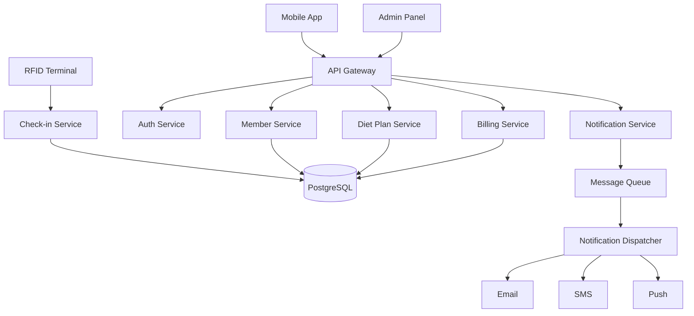
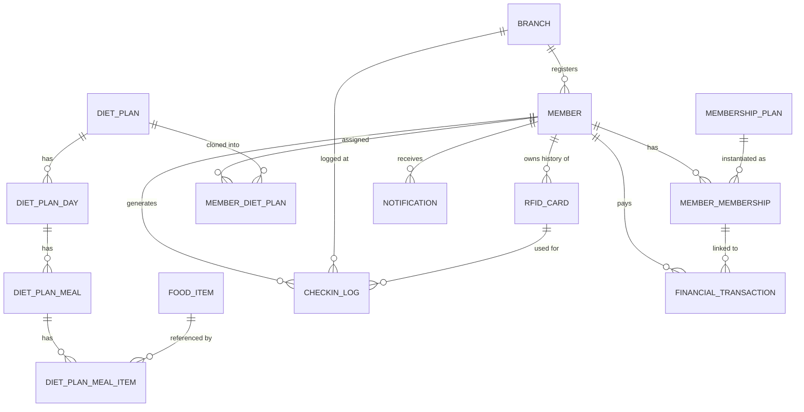
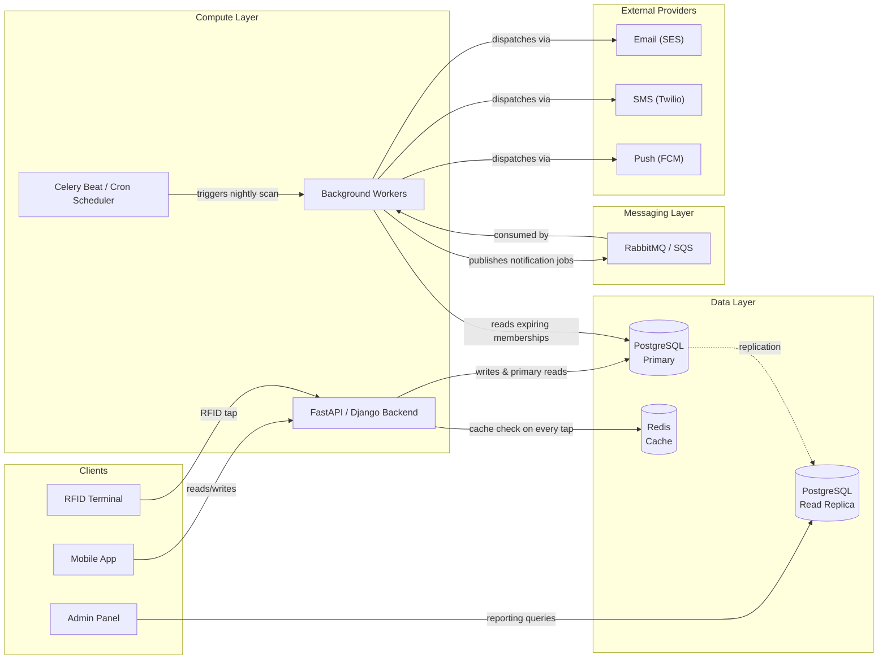
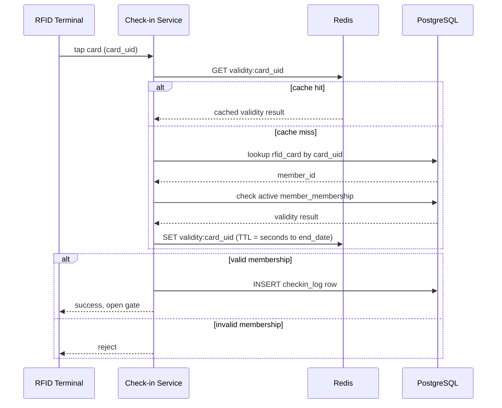
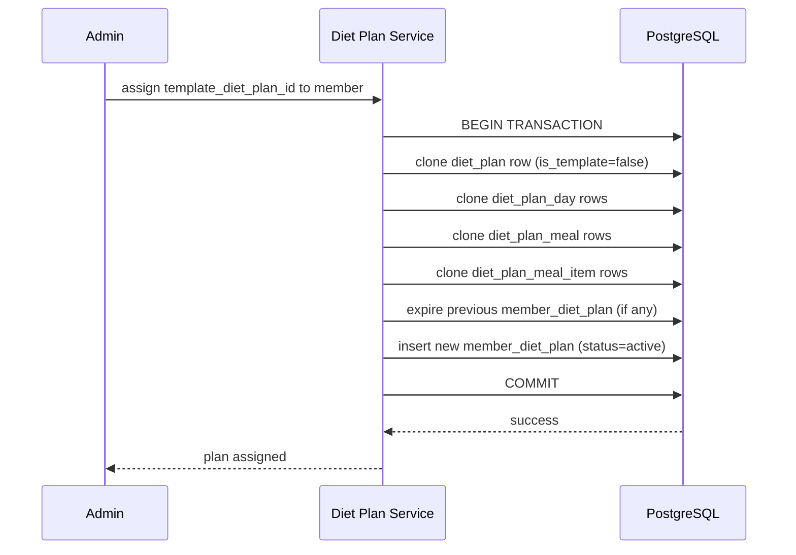
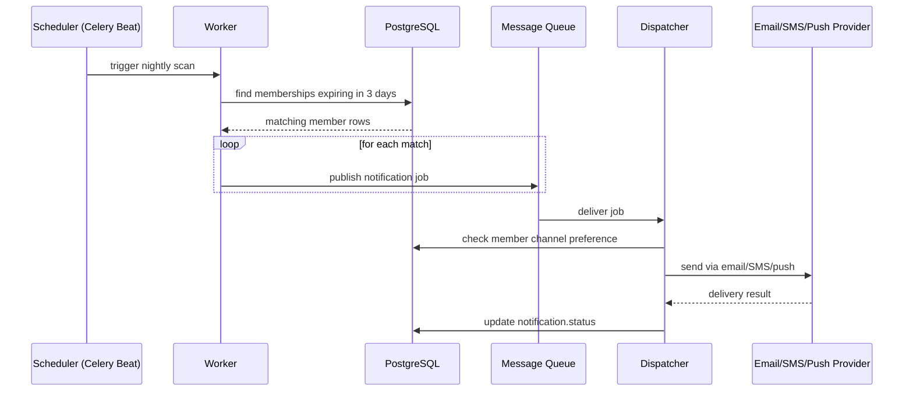
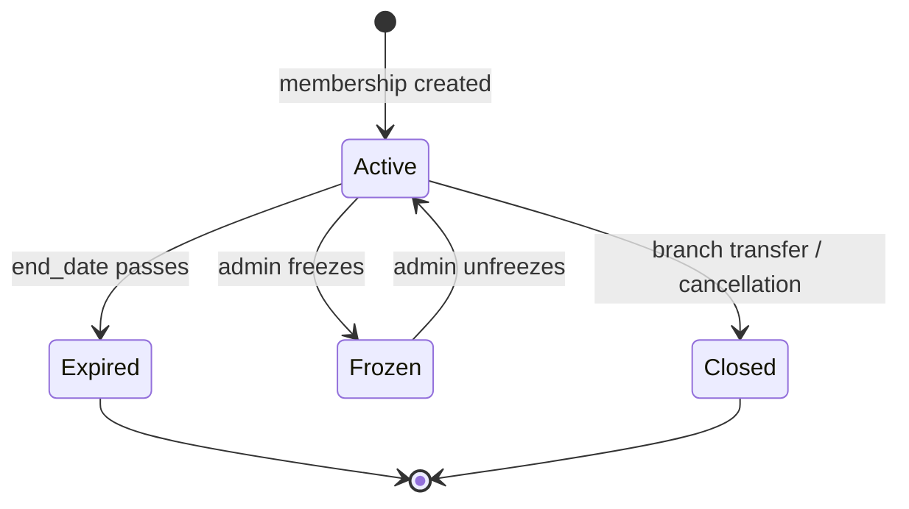

## What exactly are we building?

So I was in an interview and they asked me to design a full-fledged gym management system. This article covers all the features, High Level Design, Low Level Design, data modeling, and every decision I took. Basically a complete walkthrough of how you would design it, covering everything from requirements to schema to APIs.

Following are the things you'll learn by the end of it:

- How to gather and structure requirements for a real-world system
- How to think about HLD before touching any schema
- The exact data modeling decisions that make or break this system, and how to get them right
- Full schema, API design, and LLD flows

This article is for backend developers who want to see how a real-world system gets designed end to end. Not a toy example, but something with actual complexity: multi-branch data isolation, hardware integration, financial records, and user-facing features all in one system. If you are preparing for system design interviews, building something similar, or just want to see how data modeling decisions get made and justified, this is for you.

---

## Figuring out the requirements

Before touching any architecture or database, you need to know exactly what you're building. Skipping this step is the fastest way to design something that looks impressive but doesn't actually solve the problem.

### Functional Requirements

This includes all the features we'll be implementing in the system. Following are the features I personally chose:

- **Member registration and profile management**: members can sign up, update their details, and view their account
- **Membership plans**: both pre-built plans (like a standard 1-month or 1-year plan) and custom plans an admin can create for a specific member
- **RFID-based check-in and check-out**: members tap a card at the gym entrance to check in, and tap again to check out
- **Diet plan assignment**: admins or nutritionists assign diet plans to members, either from a template or fully customized
- **Notifications**: push, SMS, or email notifications for things like membership expiry, diet plan updates, or promotions
- **Multi-branch support**: the gym chain has multiple branches, each with its own members, staff, and traffic patterns
- **Admin panel**: admins manage members, staff, finances, and view reports across branches

### Non-Functional Requirements

This is the part that actually shows whether you understand how the system will behave under real conditions, not just what features it has.

- Each branch can have anywhere from 50 to 2,000 members
- 30 to 40% of a branch's members can be concurrently present during peak hours (think evenings and weekends)
- Check-in via RFID needs to resolve quickly, under 200ms, because nobody wants to stand at a gate waiting for a green light
- The system should stay available even if one branch's local network has issues
- Admin-side reads (like reports and analytics) can be slightly stale. Check-in writes cannot be delayed or lost

### Capacity Estimation

This step intimidates a lot of people, but it's really just arithmetic. Let me walk you through how I did it.

Take a mid-sized branch with 1,000 members. At 35% concurrency, that's 350 people in the gym at the same time during peak hours. Each person checks in once and checks out once, so that's 700 RFID events during that peak window.

If peak hours span roughly 2 hours, that's about 6 events per minute for a single branch. Now scale that across, say, 50 branches in the chain. That gives a rough estimate of write throughput on the check-in service during peak load: somewhere around 300 events per minute system-wide, with spikes higher than that.

Do the same exercise for notifications. If 100 memberships are expiring today across all branches, that's 100 notification events to process and dispatch. Not huge, but it tells you this can run as a background job rather than something real-time.

I leaned on this kind of back-of-envelope math throughout the interview. It is what separates "I listed the features" from "I know how this thing behaves under load."

---

## High Level Design

Once requirements are clear, the next step is to break the system into services. At this stage you're not writing any code or schema, you're deciding what the major moving parts are and how they talk to each other.

Here's how I split it:

- **API Gateway**: single entry point for all client requests, routes them to the right service
- **Auth Service**: handles login, session management, role-based access (member vs staff vs admin)
- **Member Service**: owns member profiles and membership data
- **Check-in Service**: handles RFID taps, validates membership, logs entries and exits
- **Diet Plan Service**: manages diet plan templates, custom plans, and assignments
- **Notification Service**: dispatches push, SMS, and email notifications
- **Billing and Finance Service**: handles payments, invoices, and financial reporting

Each service owns its own slice of data and doesn't reach into another service's tables directly. If the Notification Service needs to know a membership expired, it asks the Member Service, it doesn't query the Member Service's database directly.

Here's roughly how the system looks at a high level:



Notice that the RFID terminal talks directly to the Check-in Service, not through the regular API Gateway. That's intentional. Check-in needs to be fast and reliable, and I did not want it competing with admin dashboard traffic or getting delayed by gateway-level logic meant for other services.

### Monolith or microservices?

This question comes up in almost every system design interview. My honest answer here: start with a modular monolith.

A [modular monolith](https://martinfowler.com/bliki/MonolithFirst.html) means all these services live in one codebase and one deployment, but the code is cleanly separated by domain. Member, Check-in, Diet, Billing, Notification each get their own module with their own boundaries. You split them into separate microservices only when you have an actual scaling reason to.

In this system, the **Check-in Service** is the one strong candidate for being pulled out early. It has a hard latency requirement, it gets hit directly by hardware (RFID terminals), and its load pattern is very different from the rest of the system: short bursts during gym opening hours, near-zero traffic overnight. Everything else can comfortably live together until there is a concrete reason to split it.

### Where does the database live?

One PostgreSQL instance to start. A common mistake is assuming multi-branch means you need a separate database per branch. You don't. Branch isolation is handled at the data level using a `branch_id` column on the relevant tables, not at the infrastructure level. Separate databases per branch is premature optimization. It adds operational complexity (migrations, backups, cross-branch reporting all get harder) without solving a problem you actually have yet.

---

## Data Modeling: the part that actually matters

This is the section where I got stuck during the interview. The individual entities like Member or Branch are obvious. The part that breaks most first attempts is that **both membership plans and diet plans have two layers**: a template that an admin creates, and an instance of that template assigned to a specific member, possibly with customizations going several levels deep.

If you flatten this into one table, you'll regret it the moment someone asks what happens if the price changes after a member already signed up, or what happens when a member's diet plan is 90% the template but every other meal is swapped out.

### The template vs instance pattern

Here's the mental model that unlocks this entire schema. Think of a membership plan template like a product listing on an e-commerce site, and the member's actual membership like an order. The order points back to the product, but it also records exactly what the customer got, when they got it, and what they paid, independent of whatever the product listing says today.

The same logic applies to diet plans, except diet plans need one more layer because a single plan is not one fact, it is a structured weekly schedule: multiple meals per day, each meal made of multiple food items with quantities. A diet plan template is a recipe book. A diet plan assigned to a member is what actually landed on that member's plate, day by day, meal by meal.

I will walk through every table below, and for each one explain exactly why it is shaped the way it is. The reasoning matters more than the SQL.

### member

The core identity table. I kept this lean on purpose. Membership data, diet data, and financial data all live in their own tables, not bolted onto this one.

| Column | Type | Constraint | Notes |
|---|---|---|---|
| id | UUID | PRIMARY KEY | |
| name | VARCHAR(100) | NOT NULL | |
| email | VARCHAR(150) | UNIQUE, NOT NULL | |
| phone | VARCHAR(15) | NOT NULL | |
| branch_id | UUID | FK to branch, NOT NULL | branch where they registered |
| status | VARCHAR(20) | NOT NULL | active / inactive / banned |
| created_at | TIMESTAMP | DEFAULT now() | |

**Why it's optimized:** A wide member table with membership fields, diet fields, and payment fields crammed in forces every query, even a simple profile fetch, to drag along columns it does not need. Keeping `member` narrow means the most frequent query in the entire system (look up a member by id or email) stays fast and the row stays small enough to fit comfortably in cache.

### branch

| Column | Type | Constraint | Notes |
|---|---|---|---|
| id | UUID | PRIMARY KEY | |
| name | VARCHAR(100) | NOT NULL | |
| location | VARCHAR(200) | | |
| capacity | INT | | rough max concurrent capacity |
| created_at | TIMESTAMP | DEFAULT now() | |

Small and stable. Almost every other table carries a `branch_id` foreign key pointing here, which is what gives us branch-level data isolation without needing a separate database per branch.

### rfid_card

| Column | Type | Constraint | Notes |
|---|---|---|---|
| id | UUID | PRIMARY KEY | |
| card_uid | VARCHAR(50) | UNIQUE, NOT NULL | physical card identifier |
| member_id | UUID | FK to member, NOT NULL | |
| status | VARCHAR(20) | NOT NULL | active / blocked / replaced |
| issued_at | TIMESTAMP | DEFAULT now() | |

**Why it's optimized:** This is the table the Check-in Service reads on every single tap, so it has to be tiny and indexed precisely on `card_uid`. I deliberately did not collapse this into the `member` table. A member can lose a card, request a replacement, or have a card blocked for misuse, and I want a full history of every card ever issued to them, not a single field that gets silently overwritten. Keeping a 1:N relationship here (one member, many cards over time) costs almost nothing in storage and saves you from losing that history later.

### membership_plan (the template)

| Column | Type | Constraint | Notes |
|---|---|---|---|
| id | UUID | PRIMARY KEY | |
| name | VARCHAR(100) | NOT NULL | e.g. "1-Year Standard" |
| duration_days | INT | NOT NULL | |
| price | DECIMAL(10,2) | NOT NULL | current price |
| features | JSONB | | flexible list of included features |
| created_by | UUID | NOT NULL | admin who created it |
| created_at | TIMESTAMP | DEFAULT now() | |

This is the product catalog. It changes rarely and gets read often, which makes it a strong candidate for caching at the application layer (more on that in the LLD section).

### member_membership (the instance)

```sql
CREATE TABLE member_membership (
    id UUID PRIMARY KEY DEFAULT gen_random_uuid(),
    member_id UUID NOT NULL REFERENCES member(id),
    plan_id UUID NOT NULL REFERENCES membership_plan(id),
    branch_id UUID NOT NULL REFERENCES branch(id),
    start_date DATE NOT NULL,
    end_date DATE NOT NULL,
    price_paid DECIMAL(10,2) NOT NULL,
    payment_status VARCHAR(20) NOT NULL,
    status VARCHAR(20) NOT NULL,
    created_at TIMESTAMP DEFAULT now()
);
```

**Why it's optimized:** `price_paid` is duplicated from `membership_plan.price` on purpose. This is denormalization with a clear reason behind it. Plan prices change over time, but what a specific member actually paid on a specific date is a historical fact that must never shift just because the catalog price moved. If I had not duplicated this column, a price change next month would silently rewrite the financial history of every member who signed up under the old price the moment you joined the two tables. This single column is what keeps your billing reports honest a year from now.

### Diet plans: the part you actually asked about

A diet plan is not one row. It is a hierarchy: a plan has days, each day has meals, each meal has food items with quantities. Getting this wrong (flattening it into one table with a `notes` text field) is exactly what trips people up, because it works fine in a demo and falls apart the moment someone asks what a member is eating Wednesday evening.

Here is the shape I landed on:

```
diet_plan
  └── diet_plan_day        (one row per day of the week)
        └── diet_plan_meal       (breakfast, lunch, snack, dinner)
              └── diet_plan_meal_item   (the actual food + quantity)
```

#### diet_plan

| Column | Type | Constraint | Notes |
|---|---|---|---|
| id | UUID | PRIMARY KEY | |
| name | VARCHAR(100) | NOT NULL | |
| goal | VARCHAR(50) | | weight_loss / muscle_gain / maintenance |
| is_template | BOOLEAN | NOT NULL, DEFAULT true | false = a member-specific custom plan |
| created_by | UUID | NOT NULL | |
| created_at | TIMESTAMP | DEFAULT now() | |

**Why it's optimized:** Predefined plans and custom plans live in the same table, distinguished by a single boolean. This avoids two near-identical tables with duplicated structure underneath them (days, meals, items would otherwise need to exist twice). One schema serves both cases.

#### diet_plan_day

```sql
CREATE TABLE diet_plan_day (
    id UUID PRIMARY KEY DEFAULT gen_random_uuid(),
    diet_plan_id UUID NOT NULL REFERENCES diet_plan(id),
    day_of_week SMALLINT NOT NULL,
    UNIQUE(diet_plan_id, day_of_week)
);
```

**Why it's optimized:** `day_of_week` (1 through 7) is enough to express a repeating weekly schedule. I did not store actual calendar dates here. A diet plan repeats every week, so storing 365 day-rows a year would be pure waste, both in storage and in query complexity. The `UNIQUE` constraint on `(diet_plan_id, day_of_week)` also stops you from accidentally creating two "Monday" rows for the same plan.

#### diet_plan_meal

```sql
CREATE TABLE diet_plan_meal (
    id UUID PRIMARY KEY DEFAULT gen_random_uuid(),
    diet_plan_day_id UUID NOT NULL REFERENCES diet_plan_day(id),
    meal_type VARCHAR(20) NOT NULL,
    scheduled_time TIME,
    notes TEXT
);
```

This is where "Monday morning" actually lives: `meal_type` plus an optional `scheduled_time`. Multiple meals can hang off the same day, which is what lets you express breakfast, a mid-morning snack, lunch, and dinner all under the same Monday.

#### food_item

```sql
CREATE TABLE food_item (
    id UUID PRIMARY KEY DEFAULT gen_random_uuid(),
    name VARCHAR(100) NOT NULL,
    calories_per_unit DECIMAL(6,2),
    protein_g DECIMAL(6,2),
    carbs_g DECIMAL(6,2),
    fats_g DECIMAL(6,2),
    unit VARCHAR(20)
);
```

**Why it's optimized:** This is a lookup table, not free text. If "boiled eggs" were typed fresh into every meal as a string, you would have no way to compute total calories for a meal, no consistency across plans, and no way to fix a typo across thousands of rows. Centralizing food data here means nutrition totals can be computed on the fly with a join, and updating a food's calorie value once fixes it everywhere it is used.

#### diet_plan_meal_item

```sql
CREATE TABLE diet_plan_meal_item (
    id UUID PRIMARY KEY DEFAULT gen_random_uuid(),
    diet_plan_meal_id UUID NOT NULL REFERENCES diet_plan_meal(id),
    food_item_id UUID NOT NULL REFERENCES food_item(id),
    quantity DECIMAL(6,2) NOT NULL
);
```

The leaf node of the hierarchy. One row per food item in a meal, with how much of it.

#### Predefined vs custom, resolved

A predefined plan is simply a `diet_plan` row with `is_template = true`, fully built out with its tree of days, meals, and items. Multiple members can be assigned the exact same template.

For a custom plan, I went with **clone-on-assign**: when a member is assigned a template, the entire tree gets deep-copied into a brand new `diet_plan` row with `is_template = false`, along with fresh `diet_plan_day`, `diet_plan_meal`, and `diet_plan_meal_item` rows that belong only to that member. The nutritionist then edits this copy directly, swapping any item on any day at any meal.

I considered the alternative, a diff-based approach where the member's plan only stores overrides against the original template, but ruled it out for this system. Diet customizations here can touch any node in the tree, so the override logic needed to express that would end up more complex than just copying the tree. Clone-on-assign also means the original template stays completely untouched for future assignments, and a member's plan never silently changes just because someone edited the template it was cloned from.

#### member_diet_plan

```sql
CREATE TABLE member_diet_plan (
    id UUID PRIMARY KEY DEFAULT gen_random_uuid(),
    member_id UUID NOT NULL REFERENCES member(id),
    diet_plan_id UUID NOT NULL REFERENCES diet_plan(id),
    assigned_date DATE NOT NULL,
    valid_until DATE NOT NULL,
    status VARCHAR(20) NOT NULL DEFAULT 'active'
);
```

This is the link between a member and their own cloned plan. Querying what a member should eat Monday evening is a five-table join from here down through `diet_plan_day`, `diet_plan_meal`, `diet_plan_meal_item`, and `food_item`, filtered by `day_of_week` and `meal_type`. It looks like a lot of joins on paper, but every join is on an indexed foreign key, and the result set per query is tiny, a handful of food items for one meal, so it stays fast even without caching.

### checkin_log

```sql
CREATE TABLE checkin_log (
    id UUID PRIMARY KEY DEFAULT gen_random_uuid(),
    member_id UUID NOT NULL REFERENCES member(id),
    branch_id UUID NOT NULL REFERENCES branch(id),
    rfid_card_id UUID NOT NULL REFERENCES rfid_card(id),
    check_in_time TIMESTAMP NOT NULL,
    check_out_time TIMESTAMP,
    created_at TIMESTAMP DEFAULT now()
);
```

**Why it's optimized:** This is the highest-write table in the entire system, so every design choice here is about minimizing write overhead and keeping the hot lookup path narrow. `check_out_time` is nullable on purpose: the row is created the instant someone checks in, with this column null, and gets updated once when they check out. As a side effect, this also gives you a free, accurate answer to who is currently inside the gym right now, it's just every row where `check_out_time IS NULL`.

### notification

```sql
CREATE TABLE notification (
    id UUID PRIMARY KEY DEFAULT gen_random_uuid(),
    member_id UUID NOT NULL REFERENCES member(id),
    type VARCHAR(20) NOT NULL,
    event_trigger VARCHAR(50) NOT NULL,
    status VARCHAR(20) NOT NULL DEFAULT 'pending',
    scheduled_at TIMESTAMP,
    sent_at TIMESTAMP
);
```

### financial_transaction

```sql
CREATE TABLE financial_transaction (
    id UUID PRIMARY KEY DEFAULT gen_random_uuid(),
    member_id UUID NOT NULL REFERENCES member(id),
    branch_id UUID NOT NULL REFERENCES branch(id),
    membership_id UUID REFERENCES member_membership(id),
    amount DECIMAL(10,2) NOT NULL,
    type VARCHAR(30) NOT NULL,
    payment_method VARCHAR(30),
    created_at TIMESTAMP DEFAULT now()
);
```

**Why it's optimized:** Every transaction links back to the specific `member_membership` instance that caused it, not just to the member. This means you can trace any rupee back to the exact membership cycle it came from, which matters the moment finance asks for a reconciliation report.

### How it all connects

To summarize the relationships in plain English:

- A member can have many memberships over time, but only one active per branch
- A member has one active RFID card, with a history of past cards if any were replaced
- A member has one active diet plan at a time, cloned from a template, with its own tree of days, meals, and items
- A branch has many members
- A membership plan template can be used by many member memberships
- A diet plan template can be cloned into many member-specific diet plans

This template-instance separation is the whole trick, applied consistently across both memberships and diet plans. Once you draw this relationship out, the schema basically writes itself.

Here's the full picture as an ER diagram, it makes the template-instance split, and the diet plan hierarchy, much easier to hold in your head than the table list above:



Two things jump out once it's drawn this way. First, `MEMBER` sits at the center, every other table either belongs to a member directly or traces back to one. Second, `DIET_PLAN` is the only table with two distinct relationships into it: it's the template source for `MEMBER_DIET_PLAN`, but it's also the structural root of its own day-meal-item tree underneath it. That dual role is exactly why I gave it the `is_template` flag instead of splitting it into two tables.

### Indexing strategy

The `checkin_log` table takes the most writes by far, so it needs careful indexing:

```sql
CREATE INDEX idx_checkin_card ON checkin_log(rfid_card_id);
CREATE INDEX idx_checkin_branch_time ON checkin_log(branch_id, check_in_time);
```

`idx_checkin_card` covers the lookup that happens on literally every tap. `idx_checkin_branch_time` is a composite index that serves two purposes at once: branch-level reporting (sum of check-ins for a branch over a date range) and the "who's currently in this branch" query, since both filter on `branch_id` first.

```sql
CREATE INDEX idx_membership_member_status ON member_membership(member_id, status);
```

For `member_membership`, this covers the most common query in the system: does this member have an active membership right now. Putting `member_id` first means the index also serves any query that filters by member alone.

```sql
CREATE INDEX idx_member_diet_plan_member_status ON member_diet_plan(member_id, status);
CREATE INDEX idx_diet_plan_day_plan ON diet_plan_day(diet_plan_id);
CREATE INDEX idx_diet_plan_meal_day ON diet_plan_meal(diet_plan_day_id);
CREATE INDEX idx_diet_plan_meal_item_meal ON diet_plan_meal_item(diet_plan_meal_id);
```

The diet plan hierarchy gets an index on every foreign key in the chain. Since fetching a member's meal for a given day and meal type means walking down four tables, each one needs to be a fast indexed lookup rather than a sequential scan, or the join cost compounds at every level.

---

## Low Level Design: walking through the actual flows with the tools behind them

This is the section I want to go deep on, because a system design answer that stops at "draw boxes and arrows" doesn't hold up under follow-up questions. Before tracing individual flows, it helps to see how the actual infrastructure pieces, not just services, talk to each other. Services are logical groupings of code. The diagram below is the physical reality underneath them: what's running where, and which tool is responsible for which kind of work.



Every arrow here exists for a specific reason, not just because the box needed to connect to something. The admin panel reads from the replica, not the primary, because reporting queries can tolerate being a few seconds stale and shouldn't compete with check-in writes for the same connection pool. Redis sits directly in the request path for the API, not off to the side, because it's checked on every single RFID tap before PostgreSQL is touched at all. The scheduler and worker are separate from the main API process entirely, notification dispatch has nothing to do with handling a live HTTP request, so it runs on its own timeline.

Now let's trace through individual flows. Every one below names the actual tool I'd reach for and explains why that tool, not a different one.

### RFID Check-in Flow



The diagram covers the full flow, but two details inside it deserve a closer look. The branch on cache hit versus cache miss is the entire reason this service can hit sub-200ms latency: on a hit, the request never touches PostgreSQL at all. On a miss, it falls back to two reads against `rfid_card` and `member_membership`, then populates the cache so the next tap from that same card is a hit.

Why Redis specifically here: this path is hit on every single tap across every branch, and the underlying data (membership validity) changes rarely, only on renewal, expiry, or a manual freeze by an admin. That access pattern, extremely high read frequency against rarely-changing data, is exactly what an in-memory key-value store is built for. A round trip to Redis runs in well under a millisecond, against a PostgreSQL read that has to traverse a B-tree index and return to the connection pool, several milliseconds easily under load. At 300+ events a minute system-wide during peak hours, that gap compounds fast.

One detail worth calling out: when an admin manually freezes or cancels a membership mid-cycle, the Redis entry needs to be actively invalidated at that moment, not left to expire on its own TTL. So the membership update endpoint also issues a `DEL` on the corresponding cache key as part of the same request. This is the one place in the flow where cache invalidation has to be explicit instead of passive.

### Diet Plan Fetch Flow

1. Member opens the app and requests today's meals
2. The app calls `GET /members/{id}/diet-plan/today`
3. Diet Plan Service resolves the member's active row in `member_diet_plan`, joins down through `diet_plan_day` (filtered by today's `day_of_week`), `diet_plan_meal`, `diet_plan_meal_item`, and `food_item`
4. Since every join is on an indexed foreign key and the result set is small, this query runs directly against PostgreSQL without needing a cache layer in front of it

This flow does not need Redis. The read volume here is nowhere close to the check-in path, a member checks their diet plan a handful of times a day at most, not multiple times a minute. Adding a cache here would be solving a problem that doesn't exist yet. Knowing where not to cache is as much a design decision as knowing where to.

### Diet Plan Assignment Flow (clone-on-assign)



This entire clone needs to run inside one transaction. If the copy succeeds but the `member_diet_plan` update fails halfway, you end up with an orphaned diet plan tree and no member pointing at it, or worse, two active plans for the same member. Wrapping all of it in a single transaction means it either fully succeeds or fully rolls back, no in-between state ever gets persisted.

### Notification Dispatch Flow



The reason this goes through a queue instead of dispatching notifications directly inside the nightly job: a queue decouples deciding who needs a notification from actually delivering it. If an email provider is slow or briefly down, the job that scans for expiring memberships doesn't get blocked waiting on it, it just keeps publishing to the queue and the dispatcher catches up whenever the provider recovers. This also means you can scale the number of dispatcher workers independently of how often the scan job runs.

Running the scan itself as a nightly background job rather than a real-time check is the right call here. Membership expiry is not something that needs to be detected the instant it happens, a daily sweep with a 3-day lookahead window gives members enough notice and keeps the system simple.

---

## API Design

A quick rundown of the key endpoints. This isn't exhaustive, but it covers the core of each service.

```
POST   /auth/login
POST   /checkin                            { card_uid, branch_id }
GET    /members/{id}
POST   /members/{id}/memberships            { plan_id, branch_id }
GET    /members/{id}/diet-plan/today
POST   /admin/diet-plans/templates
POST   /admin/members/{id}/assign-diet      { template_diet_plan_id }
GET    /branches/{id}/checkins              (paginated, admin only)
GET    /admin/branches/{id}/financials
```

One thing worth calling out: the `/checkin` endpoint is the only one in this list that also gets called by hardware directly, not just by app clients. Because of that, it needs to stay stateless and fast, and it should return a minimal success or failure signal rather than a full JSON payload. The RFID terminal doesn't need a member's full profile, it just needs to know whether to open the gate.

---

## Scalability and Edge Cases

A handful of edge cases worth thinking through out loud, since these are exactly the kind of questions that come up in interviews. Most of them are really just transitions in the membership lifecycle, which is easier to reason about as a state diagram than as prose:



Every edge case below maps to one of these transitions.

**Lost or stolen RFID card.** Admin marks the card's status as `blocked` in the `rfid_card` table, and the same request issues a `DEL` on that card's Redis cache key if one exists. The Check-in Service rejects any tap from that card UID from that point forward. A new card gets issued as a fresh row, and the old row stays in the table for audit history rather than being deleted.

**Membership plan price changes.** The price on the `membership_plan` template changes. Every existing `member_membership` row is unaffected, because `price_paid` was captured at the time of purchase. New sign-ups simply get the new price.

**Member transfers to a different branch.** Since memberships are branch-scoped, a transfer means closing out the current `member_membership` row (`end_date` set to today, `status` set to closed) and creating a fresh one at the new branch, possibly with a prorated credit applied. Both writes happen in one transaction.

**Peak hour traffic spikes.** The Check-in Service is the most likely bottleneck given how latency-sensitive it is. Because each check-in request is stateless once membership validity is served from Redis, this service can scale horizontally behind a load balancer without any session affinity concerns.

**Conflicting diet plan assignments.** Covered above in the clone-on-assign flow: the old assignment gets expired and the new one inserted inside the same transaction, so two simultaneously active plans for one member is never a reachable state.

---

## What I would do differently with more time

A few things I'd add if this weren't time-boxed to an interview:

- **Event sourcing for financial transactions**, so every state change is an immutable append rather than an update. Money is one place where a full audit trail should be designed in from day one, not bolted on later
- **A proper audit log table** for admin actions, who changed what and when. The schema captures member-facing history well, but not admin-side accountability
- **A read replica for PostgreSQL** to take admin reporting queries off the primary, since reports and analytics can tolerate slightly stale data while check-in writes cannot

These weren't oversights. They were conscious scope cuts to fit the interview's time constraints, and I'd call that out directly if asked in a follow-up.

---

## Closing thoughts

The one thing this interview really taught me: a single modeling decision shapes everything downstream of it. The template-instance pattern, applied to both memberships and diet plans, is the kind of idea that sounds obvious once you've seen it and is genuinely easy to miss when you're under pressure with a whiteboard in front of you. That's exactly why questions like this show up in interviews. Nobody is testing whether you know SQL syntax. They're testing whether you can spot the right abstraction before you start writing tables, and whether you can defend every choice you made when they push back on it.